  

---

## Sobre mim

Sou **Gustavo Henrique**, desenvolvedor de software com foco em **automação, análise de dados, dashboards gerenciais** e soluções para **operações de cobrança e recuperação de crédito**.

Atuo no desenvolvimento de **sistemas internos, integrações, painéis analíticos** e ferramentas voltadas para aumento de produtividade operacional. Tenho experiência na construção de dashboards em **React**, manipulação de grandes volumes de dados, consultas **SQL**, automações de processos e integração entre diferentes plataformas.

Grande parte das minhas entregas acontece em **projetos privados e ambientes corporativos**, por isso este GitHub funciona como uma vitrine profissional da minha stack, áreas de atuação e forma de pensar soluções.

Tenho forte interesse em **arquitetura de sistemas, inteligência artificial aplicada a negócios, automação de atendimento, prospecção automatizada** e desenvolvimento de ferramentas que transformam processos manuais em operações escaláveis.

---

## Stack principal

---

## Principais competências

---

## O que eu desenvolvo

- Dashboards operacionais e gerenciais com foco em **indicadores, KPIs e tomada de decisão**
- Sistemas internos para **cobrança, CRM, gestão de carteiras e recuperação de crédito**
- Automações para reduzir processos manuais e aumentar produtividade operacional
- Integrações entre plataformas, APIs, bancos de dados e ferramentas corporativas
- Rotinas de análise, tratamento, validação e processamento de dados
- Ferramentas com inteligência artificial aplicada a atendimento, prospecção e operação

---

## Áreas de atuação

- **Business Intelligence (BI)** e dashboards analíticos
- Sistemas de cobrança e recuperação de crédito
- CRM, gestão de carteiras e monitoramento de performance
- Automação de prospecção e atendimento
- Integrações corporativas e processamento de dados
- Engenharia de prompt e inteligência artificial aplicada a negócios

---

## Objetivo

Desenvolver soluções inteligentes que simplifiquem processos complexos, aumentem a eficiência operacional e transformem dados em informações estratégicas para tomada de decisão.

---

## Vitrine profissional

---

## Projeto público em destaque

### [Credit Recovery Dashboard](https://github.com/Loira0/credit-recovery-dashboard)

Dashboard gerencial para **cobrança, recuperação de crédito, KPIs operacionais, performance de carteiras e análise por canais de contato**.

Projeto criado com dados fictícios para demonstrar desenvolvimento de interfaces corporativas, visão de negócio, React, TypeScript, análise operacional e construção de painéis para tomada de decisão.

---

## Contato

---

<strong>Transformando dados, processos e operações em soluções escaláveis.</strong>

